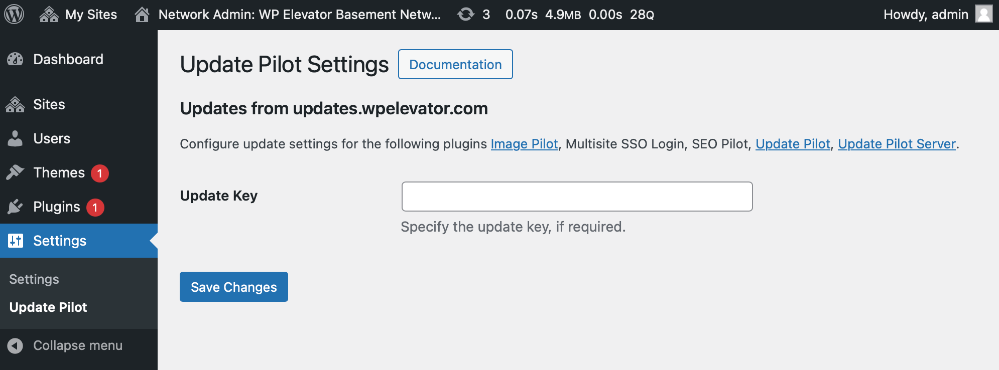

# Update Pilot

Get updates from all [Update Pilot Server](https://wpelevator.com/plugins/update-pilot-server) supported plugins and themes.

## Available Hooks

Please note that on WordPress multisite the code using these hooks should be running on the main network site as the WordPress updates happen only there.

Filters:

- `update_pilot__update_uri_key` returns `string` product key to be used for HTTP Basic auth when checking the second `string` argument `UpdateURI` for updates.

- `update_pilot__current_user_can_manage_updates` returns `bool` if the current user can configure the update pilot settings and see any error notifications.

- `update_pilot__is_update_pilot_url` returns `bool` if the second `string` argument is a valid `UpdateURI` to be checked for updates.

- `update_pilot__plugin_update_url` returns `string` of the `UpdateURI` endpoint.

## Integration Guide

1. Setup the [Update Pilot Server](https://wpelevator.com/plugins/update-pilot-server) on your server.

2. Add `Update URI` header to your plugin `https://updates.example.com/wp-json/update-pilot/v1/plugins` or theme `https://updates.example.com/wp-json/update-pilot/v1/themes`.

3. Optinally, include `update-pilot.php` in the root of your plugin or theme directory to customize any of the update functionality. This file will be included by the Update Pilot even if the rest of your plugin is disabled.
